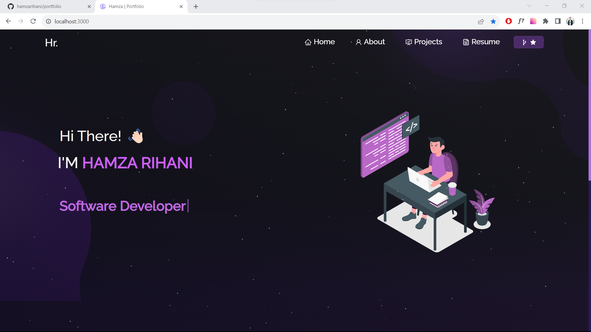
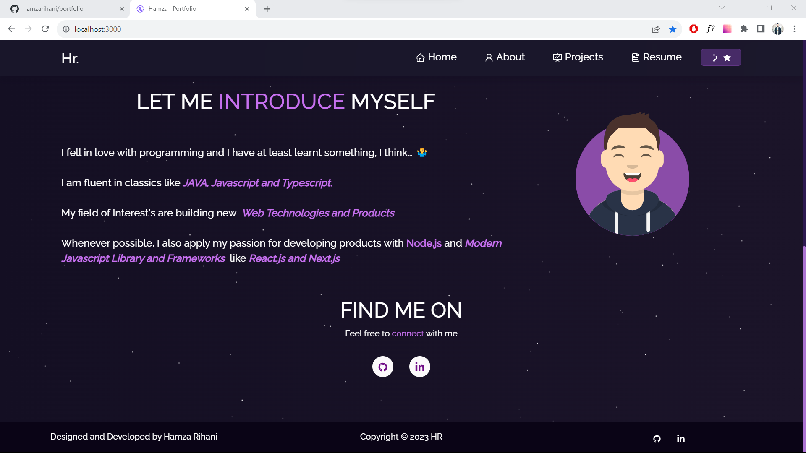
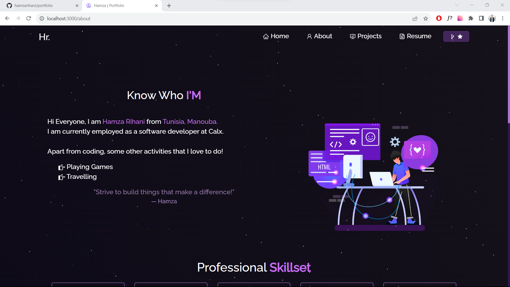
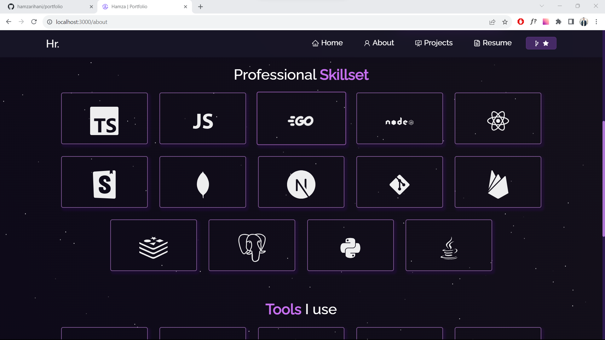
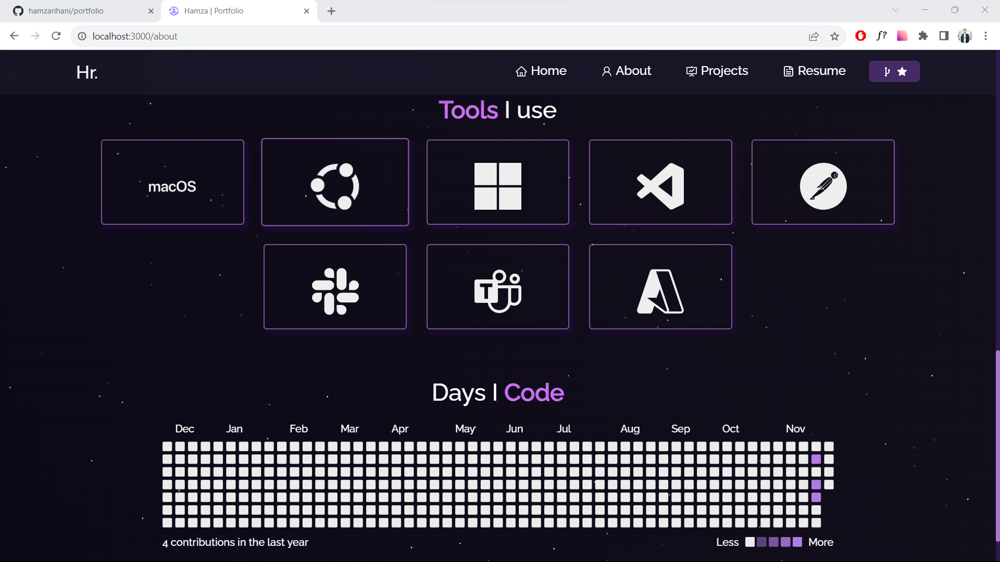
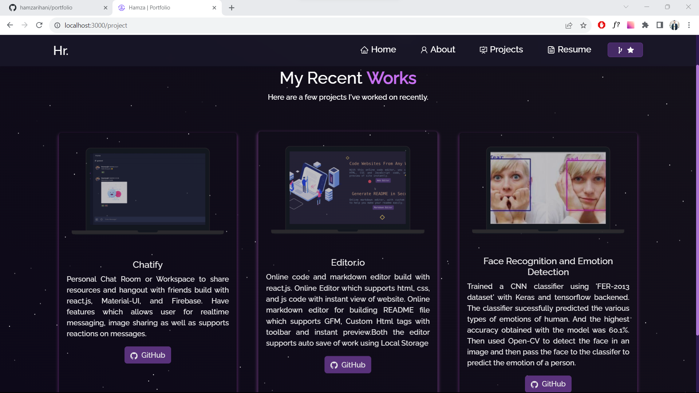
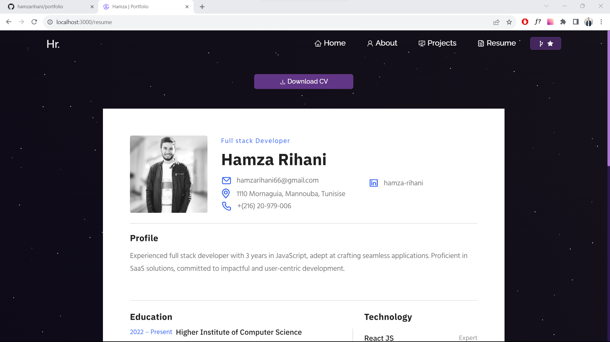

# CV Website - Dev Environment

## Prerequisites

- Docker installed

## Usage

1. Clone the repository.
2. Run the following command in the project root directory:

   ```bash
   sudo docker-compose up -d
   ```

   If you are using Windows, run:

   ```bash
   docker-compose up -d
   ```

3. Access the development environment at [http://localhost:3000](http://localhost:3000).

## Repository

Find the project on GitHub: [https://github.com/hamzarihani/portfolio](https://github.com/hamzarihani/portfolio)

## Screenshots

Find the project screenshots: ./screenshots

## Home page




## About page





## Project page



## Resume page


